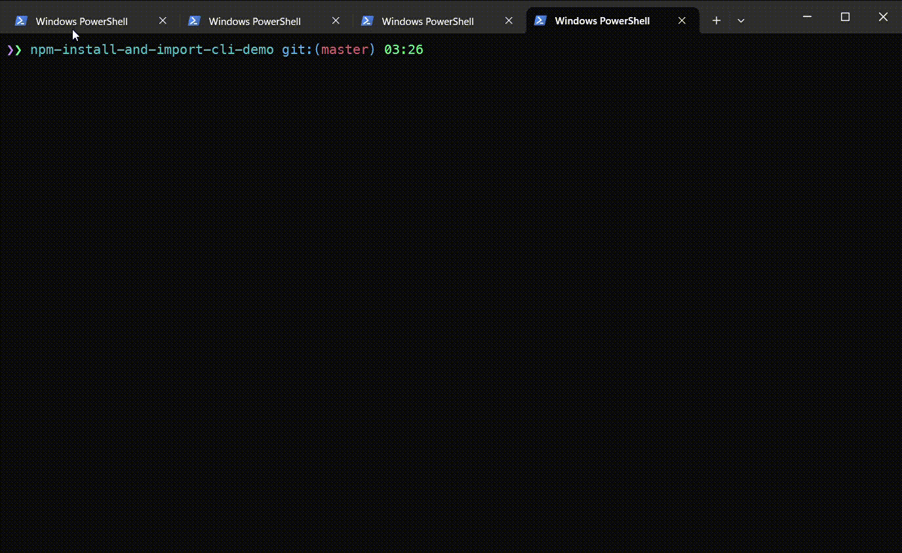

# npm-install-and-import-cli [![NPM version][npm-image]][npm-url]

> Get rid of if statements in your code by using convenient api

## Install

```sh
npm install -g npm-install-and-import-cli
```

or

```sh
yarn add --global npm-install-and-import-cli
```

## CLI

$ npm-install-and-import-cli --help

    CLI utility to install a package and add import statement to specified file

    Usage
        $ npm-install-and-import
    	$ npmii

    Options
        --name, -n     Package to install
        --filename, -f Filename where you want to add import statement to

    Examples
        $ npm-install-and-import
        $ npm-install-and-import --name consola
        $ npm-install-and-import --name consola --filename src/ui.js

## Demo



## License

MIT © [Rushan Alyautdinov](https://github.com/akgondber)

[npm-image]: https://img.shields.io/npm/v/npm-install-and-import-cli.svg?style=flat
[npm-url]: https://npmjs.org/package/npm-install-and-import-cli
